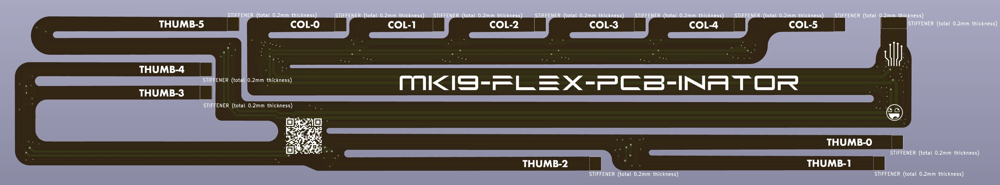
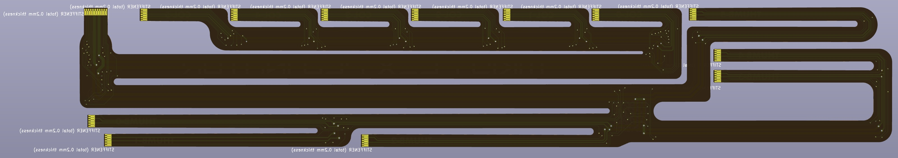
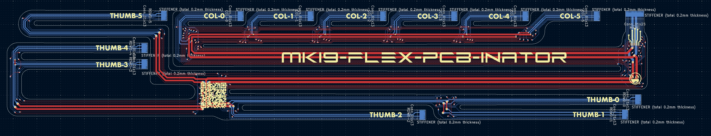
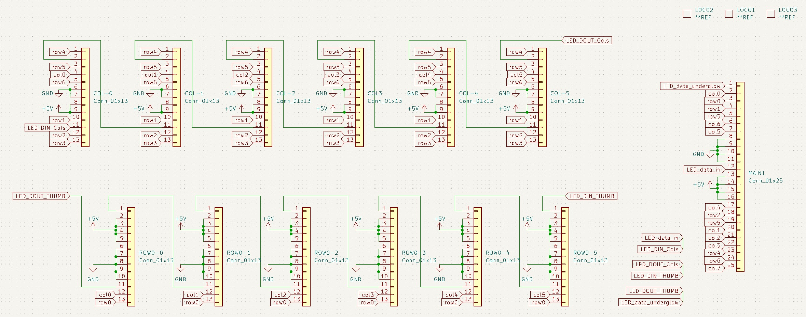

# mk19-flex-pcb
All credit to: [Cyboard](https://github.com/Cyboard-DigitalTailor/cyboard-public)

Custom flex pcb/cable/thing for the mk19 pcb rev2, an extended version of the Cyboard factory cable.


# ordering notes
## creating gerbers.zip
Follow their docs: 
- https://jlcpcb.com/help/article/495-easyeda-flex-pcb-design-user-guide
- https://jlcpcb.com/help/article/362-how-to-generate-gerber-and-drill-files-in-kicad-7

Ensure you include the User_Drawings layer.

**Example gerber file contents:**
```
mk19-flex-pcb-B_Cu.gbl
mk19-flex-pcb-B_Mask.gbs
mk19-flex-pcb-B_Paste.gbp
mk19-flex-pcb-B_Silkscreen.gbo
mk19-flex-pcb-Edge_Cuts.gm1
mk19-flex-pcb-F_Cu.gtl
mk19-flex-pcb-F_Mask.gts
mk19-flex-pcb-F_Paste.gtp
mk19-flex-pcb-F_Silkscreen.gto
mk19-flex-pcb-NPTH-drl_map.gbr
mk19-flex-pcb-NPTH.drl
mk19-flex-pcb-PTH-drl_map.gbr
mk19-flex-pcb-PTH.drl
mk19-flex-pcb-User_Drawings.gbr
mk19-flex-pcb-gerbers.zip
mk19-flex-pcb-job.gbrjob
```

## submitting the order
- whatever quantity you want
- 0.12 pcb thickness
- polyimide stiffener; 0.1mm
- 0.2mm gold fingers
- colour: white

1. On the initial order page.  The very first page where you add the gerbers.zip file.
2. Veerrrrrrry bottom: 'add pcb remark'
3. Ensure you add a comment in here that says: 
```
Please see 'mk19-flex-pcb-User_Drawings.gbr' for stiffener locations and remarks - there should be only a small amount of stiffener required. I understand this requires extra charges for the small slots - that's fine.
```

# overview










